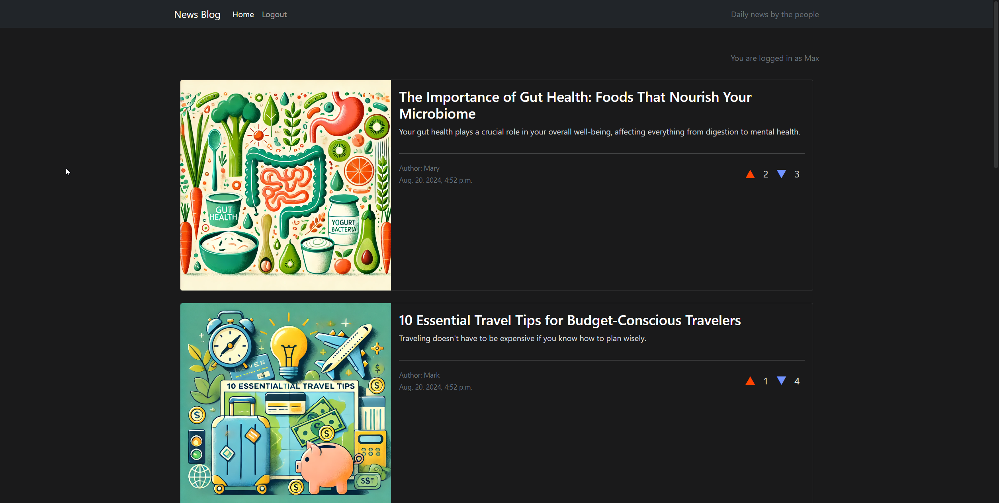
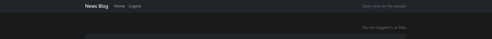
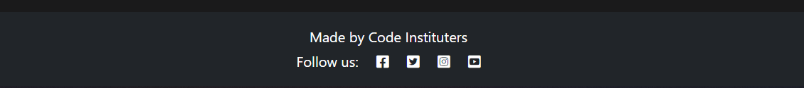
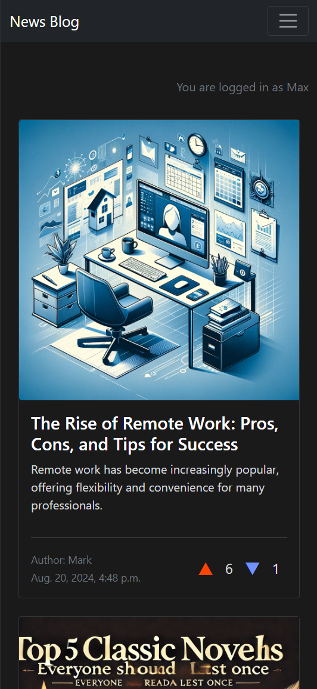
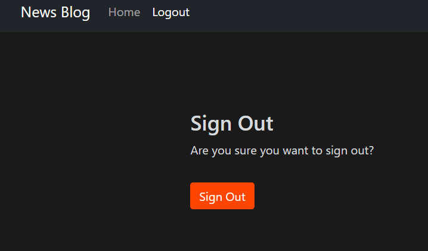
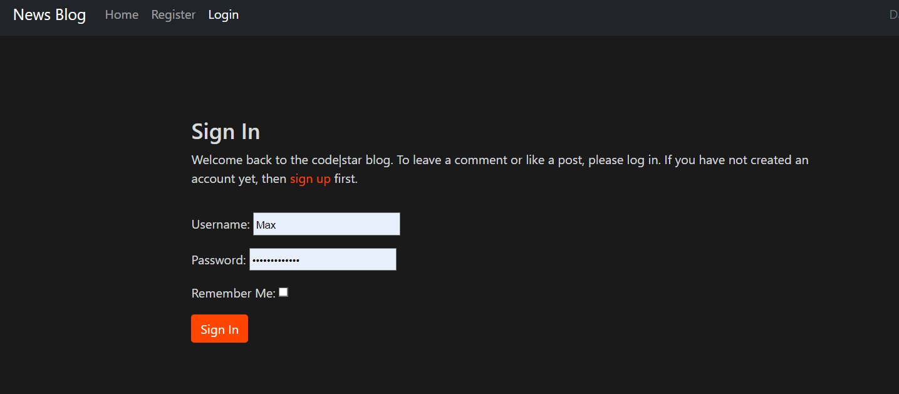
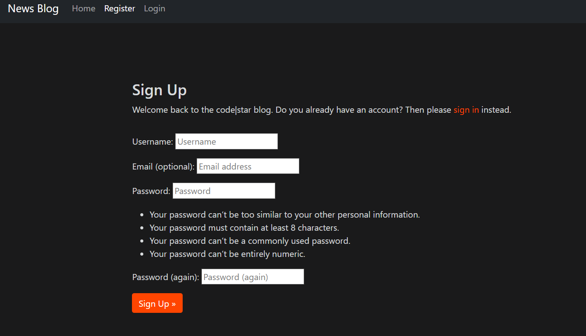
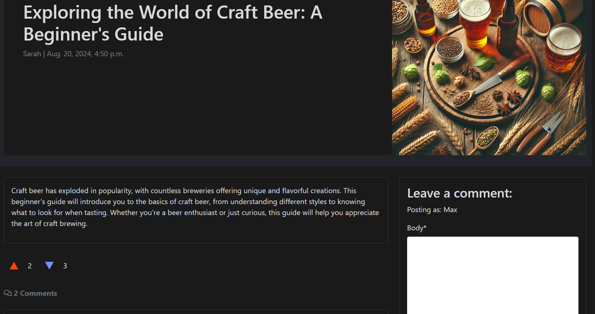
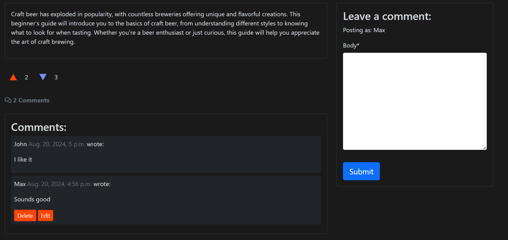

<h1 align="center">News Blog</h1>

View the website [Here](https://news-blog-mkm-d126a4c289f0.herokuapp.com/)

This is a Website that allows users to view, comment and upvote/downvote blogs.

## User Experience (UX)

-  ### User Stories

   -  #### View paginated list of posts
        1. As a site user, I can view a paginated list of posts so that I can select which post I want to view.
        2. When a user opens the main page a list of posts is seen.
        3. Then the user sees all post titles with pagination to choose what to read.

   -  #### Create Posts
        1. Users can create a new post by filling out a title, content, and selecting a category.
        2. The post will display the author's username, the time, and the date of posting.
        3. The post should be visible to all users immediately after submission.
   
   -  #### Up/Down vote on posts
        1. Users can upvote or downvote a post using buttons next to the post.
        2. The total vote count should be updated immediately after a user casts their vote.
        3. Users can only vote once per post (upvote or downvote).

   -  #### Comment on posts
        1. Users can leave a comment on any post.
        2. Comments are displayed below the post, with the newest comments at the top or bottom, depending on the site's design.
        3. Each comment displays the username of the commenter, the time, and the date it was posted.

   -  #### Account registration
        1. Given an email a user can register an account.
        2. Then the user can log in.
        3. When the user is logged in they can comment.

   -  #### Modify or delete comment on a post
        1. Given a logged in user, they can modify their comment.
        2. Given a logged in user, they can delete their comment.

   -  #### Manage posts
        1. Given a logged in user, they can create a blog post.
        2. Given a logged in user, they can read a blog post.
        3. Given a logged in user, they can update a blog post.
        4. Given a logged in user, they can delete a blog post.

   -  #### Create drafts
        1. Given a logged in user, they can save a draft blog post.
        2. Then they can finish the content at a later time.

   -  #### Approve comments
        1. Given a logged in user, they can approve a comment.
        2. Given a logged in user, they can disapprove a comment.

- ### Design
  - #### Colour Scheme
    - The two main colours used in this project are dark grey and white.
  - #### Typography
    - The two fonts used in this project are Roboto and Lato. Roboto is a clear and clean style of font that allows easy reading and looks clean. Lato is used in a similiar manner, but slightly different font to draw attention to other areas.
  - #### Imagery
    - The images used on this site are images that are used by the site users, to accompany their posts.

## Features
  - #### Navigation Bar
    - The Navigation bar is simple and clean. it allows users quick access to the home page, as well as letting them logout, login or register to the site.
    
  - #### Footer
    - Added social media links and icons to the footer. All links open in a new tab. This is an easy and visually pleasing way to have users gain access to your social media pages.
    The icons make the aesthetic of the page nicer, rather than have words or links to click.
    
  - #### Pagination
    - The Pagination allows up to 6 posts per page. At the bottom of the page there are Next/Previous buttons that allow the user to switch between pages.
    
  - #### Responsiveness
    - Website is responsive to all screen sizes. This means that on each device the website looks clean but also gives the user all the information they need on the blog.
    
  - #### Accounts
    - The accounts feature allows users to register to the site. It then allows them to login and out of their account. Their name will appear beside the posts they make and also the comments.
    
    
    
  - #### Voting
    - The voting feature allows users to up or down vote each post, to express their opinion on it, which will help other users judge useful posts before they view it.
    
    
  - #### Comments
    - The comments feature allows users to comment on posts. They can also delete or edit their comment. It will have to be approved by the admin first though.
    
  
## Technologies Used

- [Cloudinary](https://cloudinary.com/)
- [Crispy Bootstrap](https://pypi.org/project/crispy-bootstrap5/)
- [Gunicorn](https://gunicorn.org)
- [Psycopg2](https://www.psycopg.org/docs/)
- [Whitenoise](https://pypi.org/project/whitenoise/5.3.0/)
- [Django](https://www.djangoproject.com/)
- [DjangoAllAuth](https://docs.allauth.org/)
- [DjangoCrispyForms](https://django-crispy-forms.readthedocs.io/en/latest/)
- [DjangoSummerNote](https://pypi.org/project/django-summernote/)

### Languages used

- [HTML5](https://en.wikipedia.org/wiki/HTML)
- [CSS3](https://en.wikipedia.org/wiki/CSS)
- [ES6](https://en.wikipedia.org/wiki/JavaScript)
- [Python](https://en.wikipedia.org/wiki/python)

### Framesworks, Libraries & Programmes Used

1. [Google Fonts](https://fonts.google.com/)
    Google Fonts was used to styles the font throughout the website.
2. [Font Awesome](https://fontawesome.com/)
    Font Awesome was used to add the icons for the social media links in the footer, as well as the burger icon in the navbar for smaller screens.
3. [Git](https://git-scm.com)
    Git was used for version control by utilizing the Gitpod terminal to commit to Git and push to GitHub.
4. [GitHub](https://github.com/)
    GitHub was used to store the projects code after being pushed by Git.
4. [Bootstrap](https://getbootstrap.com)
    Bootstrap was used to build fast and responsive styling for the site.

## Testing
The W3C Markup Validator and W3C CSS Validator Services were used to validate every page of the project to ensure there were no syntax errors in the project.
 - [W3C Markup Validator](https://validator.w3.org/)
 - [W3C CSS VALDATOR](https://jigsaw.w3.org/css-validator/)
 - [JSLint](https://www.jslint.com/)
 - [PEP8](https://pep8ci.herokuapp.com/)

 - With the W3C Markup Validator, I am getting 2 errors saying I didn' close a certain div and main. However I have, I have ran the code through multiple other sources and it came back clean.
    !(static/images/error.png)

### Testing User Stories from User Experience (UX) Section
-  ### User Stories

   -  #### View paginated list of posts
        1. Users are able to view specific posts by clicking on them.
        2. All posts are visible to the user to chose what to click on and read.
        3. All post titles are clearly visible on the home page for the user.

   -  #### Create Posts
        2. The user is able to see the authors name for their post, as well as the content.
   
   -  #### Up/Down vote on posts
        1. Users are able to see and use the voting system. When they click on the arrow, they will have voted
        2. The number of up and down votes each post has is visible next to the arrows.
        3. Users are only able to use one vote up or down, if they select one but then click the other, it will remove it and add it to the other vote.

   -  #### Comment on posts
        1. Users are able to leave comments on any post they choose via the comment section and box.
        2. Comments are displayed below the post, there is also an indicator to show how many comments have been left on each post.
        3. Every comment made shows the user who made it, the time in which they posted it and also the date of posting.

   -  #### Account registration
        1. A user can register to the site if they have an email and choose a valid password.
        2. Once register, the user can log into the site with their chosen email and password.
        3. Once logged in, the user is able to view, comment and vote on posts.

   -  #### Modify or delete comment on a post
        1. The user can edit their comments and it will be updated when the admin approves it.
        2. The user can delete their comment if they decide to.

   -  #### Manage posts
        2. When a user is logged in, they are able to view any post on the site.

   -  #### Create drafts
        1. When posts are created they can either be drafted or published.

   -  #### Approve comments
        1. Once a user comments on a post, it will be awaiting approval by the admin.
        2. Users can delete their comments if they so choose.

### Further Testing 
  - The website was viewed on multiple devices such as iphone 15, laptop, tablet, PC.
  - All page links and buttons were tested to ensure they are correctly working and have the correct links.
  - Family and Friends were sent links to the website to ensure no bugs were found on their own devices.

### Future Features
  - No ability to post directly from the site, only through the admin panel, I tried to implement this but couldn't due to time restraints
  - The alert for deleting and editing comments are the same colour, it would be nicer to have a colour difference for UI.

### Known bugs
  - Due to the borders on the posts, at the bottom of the page there is a build up of multiple margins at the next/previous button. It is being overwritten somewhere but has seemed to be resolved.

## Deployment

### Heroku
The project was deployed with Heroku using these steps...
  - Log in to Heroku
  - Click the button to create a new app.
  - Select Europe and create a name for the project
  - Once the config vars have been sorted, go to deploy and connect via Github.
  - Select the repository you are using.
  - Login to Heroku in the terminal with the API key in the account settings.
  - Go to the deploy page and scroll down until you see manual deploy and select it.
  - Once deployed, click open app at the top of the page to view your site.

### Preview Site Port
I also deployed a preview of the site throughout the process through a local port.
  - In codeanywhere I would select the terminal and write 'python3 -m https.server'
  - I would select the 'Port' tab in the bottom right.
  - I would select Port 8000 and click 'open in a new tab'.

 
## Credits

### Code
 - The site was followed along by the Code Institute's "I think before I blog" project.
 - Here I learned what I needed about databases and Django specifically
 - I also learned multiple frameworks and libraries through this.   

 ### Content & Media
  - All content was written by the developer, but helped with multiple sources (including the images) such as ... 
    - [ChatGPT](https://en.wikipedia.org/wiki/ChatGPT)
    - [Reddit](https://reddit.com)
    - [YouTube](https://youtube.com)

### Acknowledgements
 - My mentor for continued help and feedback throughout the project.
 - The Code Institute tutor support team for help with problems within the code.   