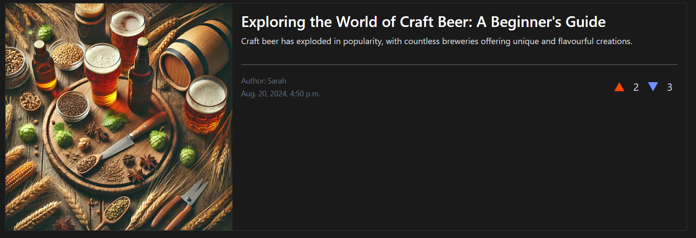

<h1 align="center">News Blog</h1>

View the website [Here](https://news-blog-mkm-d126a4c289f0.herokuapp.com/)

This is a Website that allows users to view, comment and upvote/downvote blogs.

## User Experience (UX)

-  ### User Stories

   -  #### View paginated list of posts
        1. As a site user, I can view a paginated list of posts so that I can select which post I want to view.
        2. When a user opens the main page a list of posts is seen.
        3. Then the user sees all post titles with pagination to choose what to read.

   -  #### Create Posts
        1. Users can create a new post by filling out a title, content, and selecting a category.
        2. The post will display the author's username, the time, and the date of posting.
        3. The post should be visible to all users immediately after submission.
   
   -  #### Up/Down vote on posts
        1. Users can upvote or downvote a post using buttons next to the post.
        2. The total vote count should be updated immediately after a user casts their vote.
        3. Users can only vote once per post (upvote or downvote).

   -  #### Comment on posts
        1. Users can leave a comment on any post.
        2. Comments are displayed below the post, with the newest comments at the top or bottom, depending on the site's design.
        3. Each comment displays the username of the commenter, the time, and the date it was posted.

   -  #### Account registration
        1. Given an email a user can register an account.
        2. Then the user can log in.
        3. When the user is logged in they can comment.

   -  #### Modify or delete comment on a post
        1. Given a logged in user, they can modify their comment.
        2. Given a logged in user, they can delete their comment.

   -  #### Manage posts
        1. Given a logged in user, they can create a blog post.
        2. Given a logged in user, they can read a blog post.
        3. Given a logged in user, they can update a blog post.
        4. Given a logged in user, they can delete a blog post.

   -  #### Create drafts
        1. Given a logged in user, they can save a draft blog post.
        2. Then they can finish the content at a later time.

   -  #### Approve comments
        1. Given a logged in user, they can approve a comment.
        2. Given a logged in user, they can disapprove a comment.

- ### Design
  - #### Colour Scheme
    - The two main colours used in this project are dark grey and white.
  - #### Typography
    - The two fonts used in this project are Roboto and Lato. Roboto is a clear and clean style of font that allows easy reading and looks clean. Lato is used in a similiar manner, but slightly different font to draw attention to other areas.
  - #### Imagery
    - The images used on this site are images that are used by the site users, to accompany their posts.

## Features
  - #### Navigation Bar
    - The Navigation bar is simple and clean. it allows users quick access to the home page, as well as letting them logout, login or register to the site.
    
  - #### Footer
    - Added social media links and icons to the footer. All links open in a new tab. This is an easy and visually pleasing way to have users gain access to your social media pages.
    The icons make the aesthetic of the page nicer, rather than have words or links to click.
    
  - #### Pagination
    - The Pagination allows up to 6 posts per page. At the bottom of the page there are Next/Previous buttons that allow the user to switch between pages.
    
  - #### Responsiveness
    - Website is responsive to all screen sizes. This means that on each device the website looks clean but also gives the user all the information they need on the blog.
    
  - #### Accounts
    - The accounts feature allows users to register to the site. It then allows them to login and out of their account. Their name will appear beside the posts they make and also the comments.
    
    
    
  - #### Voting
    - The voting feature allows users to up or down vote each post, to express their opinion on it, which will help other users judge useful posts before they view it.
    
    
  - #### Comments
    - The comments feature allows users to comment on posts. They can also delete or edit their comment. It will have to be approved by the admin first though.
    
  
## Technologies Used

- [Cloudinary](https://cloudinary.com/)
- [Crispy Bootstrap](https://pypi.org/project/crispy-bootstrap5/)
- [Gunicorn](https://gunicorn.org)
- [Psycopg2](https://www.psycopg.org/docs/)
- [Whitenoise](https://pypi.org/project/whitenoise/5.3.0/)
- [Django](https://www.djangoproject.com/)
- [DjangoAllAuth](https://docs.allauth.org/)
- [DjangoCrispyForms](https://django-crispy-forms.readthedocs.io/en/latest/)
- [DjangoSummerNote](https://pypi.org/project/django-summernote/)

### Languages used

- [HTML5](https://en.wikipedia.org/wiki/HTML)
- [CSS3](https://en.wikipedia.org/wiki/CSS)
- [ES6](https://en.wikipedia.org/wiki/JavaScript)
- [Python](https://en.wikipedia.org/wiki/python)

### Framesworks, Libraries & Programmes Used

1. [Google Fonts](https://fonts.google.com/)
    Google Fonts was used to styles the font throughout the website.
2. [Font Awesome](https://fontawesome.com/)
    Font Awesome was used to add the icons for the social media links in the footer, as well as the burger icon in the navbar for smaller screens.
3. [Git](https://git-scm.com)
    Git was used for version control by utilizing the Gitpod terminal to commit to Git and push to GitHub.
4. [GitHub](https://github.com/)
    GitHub was used to store the projects code after being pushed by Git.
4. [Bootstrap](https://getbootstrap.com)
    Bootstrap was used to build fast and responsive styling for the site.

## Testing
The W3C Markup Validator and W3C CSS Validator Services were used to validate every page of the project to ensure there were no syntax errors in the project.
 - [W3C Markup Validator](https://validator.w3.org/)
 - [W3C CSS VALDATOR](https://jigsaw.w3.org/css-validator/)
 - [JSLint](https://www.jslint.com/)
 - [PEP8](https://pep8ci.herokuapp.com/)

### Testing User Stories from User Experience (UX) Section

 - #### First Time Visitor Goals
   1. As a first time visitor, I want to understand and learn about the topic of the website.
      1. When users open the site, they are greeted with a clean and simple first page. The navigation bar is easy to read and easy to navigate through the pages.
      2. The main image is powerful yet clean. It is accompanied by small text with a black background for ease of reading, of a brief intro to the story.
      3. Users can either scroll or click the button that will automatically bring them down to the next intro section.
   2. As a first time visitor, I want to be able to easily navigate through the website and also have visual help with guidance of the website and topics.
      1. The navigation bar is clean and has visual help to show users what pages they are currently on. If a user wants to navigate to a different page this is highlighted when they hover over the page link.
      2. The navigation bar always shows each page so that users can always and easily go back to their previous page so they never feel trapped.
      3. The forms sections is clean and easily readable. When customers fill out their details, the form will show them what is required when filling it out so they are never confused.  
   3. As a first time visitor, I want to have reliable and trusted information about the topic at hand.
      1. The information about the story is always accumpanied by famous images that will support the reliability of the site. 
      2. All the information throughout the website has been gathered by multiple trusted sources to tell the story in short but precise text.
  
- #### Returning Visitor Goals

   1. As a returning visitor, I want to find information about the history.
      1. The about us section will provide users an insight of our motives and enthusiasm for history, that will give them an view of the passion behind the research and topics.
      2. Users can sign up to a newsletter through the contact forms, allowing them to keep up to date on previous or new historical topics. 
   2. As a returning visitor, I want to be able to contact the team behind the website and be able to follow up and any questions or queries I may have.
      1. All social media links are shown in the footer, so that users can follow us on multiple platforms and reach out if needed or wanted.
      2. Users can use the contact form to send us their details so that we can reach out and start up a conversation.
      3. Users can submit feedback about the site and topics, or give suggestions on the next topic that will be covered.  
   3. As a returning visitor, I want to find social media links to follow up on more information.
      1. Users can find all social media accounts on the footer, to follow us on updates.
      2. Users can find like minded people in the community for discussions. They can also give input on the future topics.
      3. Customers have easy access to a newsletter that will be emailed to them frequently.

- #### Frequent Visitor Goals

   1. As a frequent user, I want to see if there is any new or updated information about this topic or new releases of events in history.
      1. Through the newsletter, users will recieve all information and updates on new releases.

### Further Testing 
  - The website was viewed on multiple devices such as iphone 15, laptop, tablet, PC.
  - All page links and buttons were tested to ensure they are correctly working and have the correct links.
  - Family and Friends were sent links to the website to ensure no bugs were found on their own devices.

### Known bugs
  - Navigation bar was resizing itself throughout the project. This was fixed with the help of tutors, the code was not saving itself correctly but has been fixed.
  - Forms were falling through the footer and extending the page at certain points.

## Deployment

### Github pages
The project was deployed with GitHub using these steps...
  - Log in to Github and locate the GitHub repository 'CI-Project-1'
  - At the top of the repository locate the 'Settings' button.
  - Scroll down the settings page until you locate the 'GitHub Pages'.
  - Under 'Source', select 'none' and select master 'branch'.
  - The page will refresh
  - Scroll back down and locate the published site link in the 'GitHub pages' section.

### Preview Site Port
I also deployed a preview of the site throughout the process through a local port.
  - In codeanywhere I would select the terminal and write 'python3 -m https.server'
  - I would select the 'Port' tab in the bottom right.
  - I would select Port 8000 and click 'open in a new tab'.
 
## Credits

### Code
 - The navigation bar was followed along by [Code Institute's](https://codeinstitute.net/ie/) "Love Running" Project tutorials.
 - The scroll button used for 'click to view more' was helped by [Reddit](https://www.reddit.com/r/csshelp/) CSS form, since I was having problems with the button scrolling too far 
 past the section.   

 ### Content & Media
  - All content was written by the developer, but helped with multiple sources (including the images) such as ... 
    - [Wikipedia](https://en.wikipedia.org/wiki/Battle_of_Alesia)
    - [Britannica](https://www.britannica.com/event/Battle-of-Alesia-52-BCE)
    - [ImperiumRomanum](https://imperiumromanum.pl/en/battles/battle-of-alesia/)
    - [ThoughtCo](https://www.thoughtco.com/gallic-wars-battle-of-alesia-2360869)

### Acknowledgements
 - My mentor for continued help and feedback throughout the project.
 - The Code Institute tutor support team for help with problems within the code.   